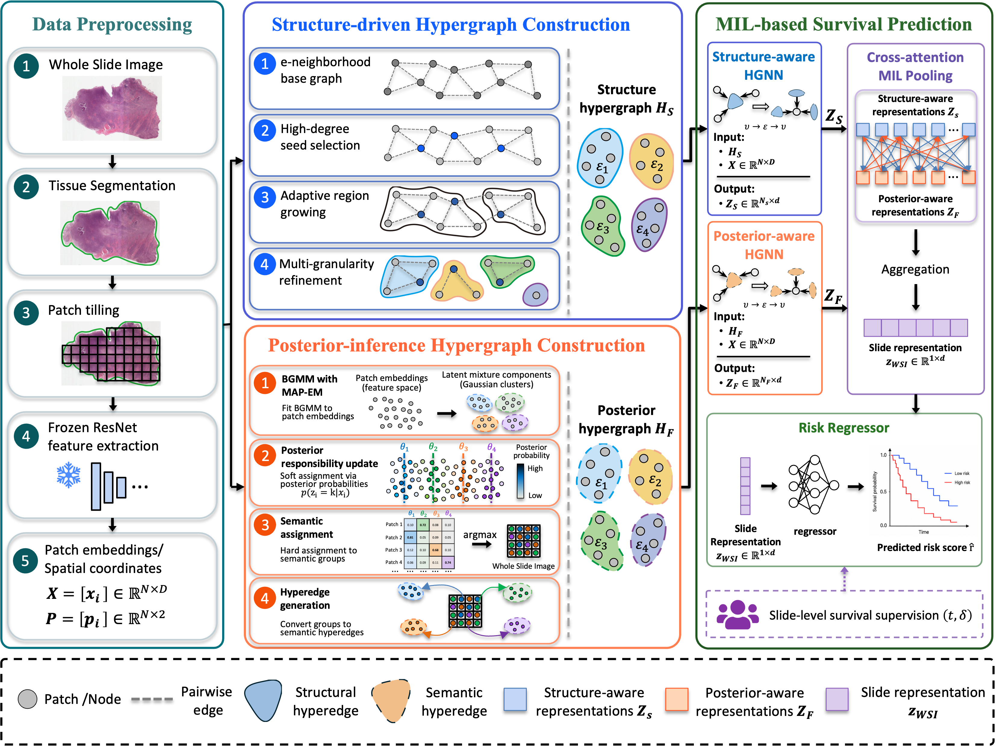

# HyperMIL: Integrating Structural Priors and Posterior Inference for Survival Prediction on Whole Slide Images


**Figure 1. The framework of the proposed HyperMIL.**

**Abstract -** Survival prediction from whole-slide histopathological images requires modeling not only discriminative tissue patterns, but also their spatial organization and microenvironmental interactions. However, most multiple instance learning methods aggregate patch features through attention or pairwise relations, which weakens their ability to capture high-order tissue associations. Existing graph- and hypergraph-based methods further depend on fixed neighborhoods or predefined similarity rules, making it difficult to adaptively represent tumor microenvironmental regions with variable spatial extent and heterogeneous tissue composition.

To address this issue, we propose HyperMIL, a hypergraph multiple instance learning framework for survival prediction from whole-slide images. HyperMIL represents each sampled patch as a vertex in an intra-slide hypergraph and introduces two complementary hypergraph construction strategies. Posterior-adaptive semantic grouping infers patch-level posterior assignments to connect histologically homogeneous patches beyond local spatial proximity, while multi-granularity adaptive segmentation partitions the slide topology into structurally coherent regions to model heterogeneous tissue compositions within the tumor microenvironment. These two mechanisms jointly capture long-range semantic consistency and topology-aware regional interactions, producing discriminative slide-level representations for prognostic modeling.

Experiments on four TCGA cohorts demonstrate that HyperMIL outperforms representative multiple instance learning, graph-based, and hypergraph-based baselines. Qualitative analyses further show that the learned hypergraph structures highlight prognostically relevant tissue patterns, suggesting improved interpretability for whole-slide image-based survival analysis.

## Repository Structure

```text
HyperMIL/
|-- README.md
|-- requirements.txt
|-- train_survival.py
|-- train_hypermil.sh
|-- models.py
|-- utils.py
|-- build_PASG_hypergraph.py
|-- build_MGAS_hypergraph.py
|-- docs/
|   `-- figures/
|       `-- overall_pipeline.png
|-- svs_process/
|   |-- README.md
|   |-- preprocess_config.yaml
|   |-- preprocess_wsi.py
|   `-- run_preprocess.sh
`-- WSI_data/
    |-- README.md
    |-- TCGA-STAD/
    |-- TCGA-THCA/
    |-- TCGA-CHOL/
    `-- TCGA-LIHC/
```

The clinical tables and split files under `WSI_data/` are derived from The Cancer Genome Atlas (TCGA) cohorts. Raw WSI files are not redistributed in this repository and should be downloaded from the TCGA/GDC portal according to the applicable data-use policy.

## Environment

```bash
conda create -n HyperMIL python=3.10 -y
conda activate HyperMIL
pip install -r requirements.txt
```

The preprocessing pipeline uses OpenSlide through `openslide-python` and `openslide-bin`. Device selection is handled by the scripts unless configured separately.

## Data Preparation

For each dataset, organize raw slides and clinical files as follows. The example below uses TCGA-STAD.

```text
svs_process/raw_svs/TCGA-STAD/*.svs
WSI_data/TCGA-STAD/clinical.tsv
WSI_data/TCGA-STAD/splits_seed42/
```

Edit `svs_process/preprocess_config.yaml` before preprocessing:

```yaml
data_root: "svs_process/raw_svs/TCGA-STAD"
save_dir: "WSI_data/TCGA-STAD"
```

Run preprocessing:

```bash
bash svs_process/run_preprocess.sh
```

Preprocessing writes:

```text
WSI_data/TCGA-STAD/patch_ft/
WSI_data/TCGA-STAD/patch_coor/
WSI_data/TCGA-STAD/sampled_vis/
```

## Hypergraph Construction

Build the PASG hypergraph:

```bash
python build_PASG_hypergraph.py --dataset STAD
```

Build the MGAS hypergraph:

```bash
python build_MGAS_hypergraph.py --dataset STAD
```

The generated hypergraphs are saved under:

```text
PASG_Hyperedge/STAD/
MGAS_Hyperedge/STAD/
```

Replace `STAD` with `THCA`, `CHOL`, or `LIHC` for the other supported cohorts.

## Training

Train HyperMIL with the default five-fold stratified cross-validation protocol:

```bash
DATASET=STAD LOSS_TYPE=cox bash train_hypermil.sh
```

Common options can be set through environment variables:

```bash
DATASET=STAD \
LOSS_TYPE=cox \
BS=8 \
LR=1e-4 \
EPOCHS=100 \
SEED=42 \
bash train_hypermil.sh
```

The training script supports `mse`, `nll`, `cox`, and `bcr` losses.

## Evaluation

After training, saved checkpoints can be evaluated with:

```bash
python train_survival.py \
  --dataset STAD \
  --loss_type cox \
  --batch_size 8 \
  --lr 1e-4 \
  --seed 42 \
  --eval_only
```
